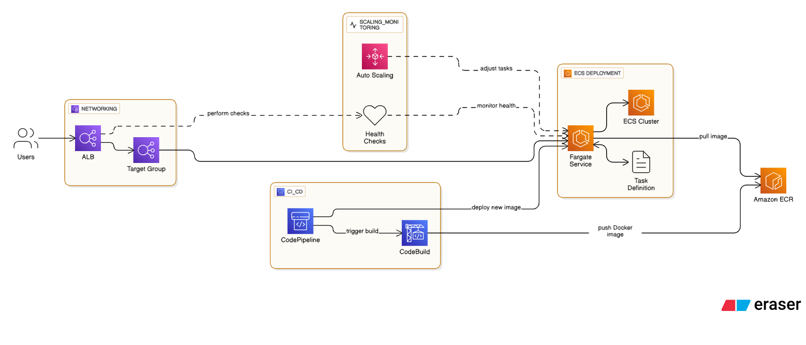

# 🚀 Build and Deploy a Containerized React App on AWS ECS Fargate via CodePipeline

This guide walks you through building, containerizing, and deploying a React application using **Docker**, **AWS ECS Fargate**, and **AWS CodePipeline**. It includes infrastructure setup, IAM roles, auto-scaling, and troubleshooting tips.

---

## 📁 Project Requirments

- Deploy Docker App on ECS Fargate with CI/CD
- Background: ECS Fargate offers serverless container deployment without needing to
manage EC2 infrastructure.
- Objective: Build and deploy a containerized app on ECS Fargate via CodePipeline.

# Tools & Services:
- Docker, Amazon ECR, ECS Fargate, ALB, CodePipeline
Implementation Steps:
1. Dockerize app and push to ECR.
2. Create ECS Cluster and Task Definition.
3. Set up ALB with target groups.
4. Deploy via CodePipeline.
5. Enable auto-scaling and health checks.
# Hints:
- Ensure IAM roles allow ECR pull.
- Set up environment variables through Task Definition.
Expected Outcome:
- Containerized service running and exposed via ALB.

---
##  Architecture_Digram



---
## 📁 Project Structure

```plaintext
my-react-app/
├── Dockerfile
├── buildspec.yml
├── package.json
├── public/
│   └── index.html
└── src/
    ├── App.js
    ├── index.js
    └── App.css
```

### 📄 File Descriptions

- `public/index.html` – Main HTML page of the application  
- `src/` – Source code of the React app  
- `Dockerfile` – Docker configuration for containerizing the app  
- `buildspec.yml` – CodeBuild instructions for building and pushing the Docker image  
- `package.json` – Node.js dependencies and scripts  
- `README.md` – Project documentation  

---

## 🛠️ Prerequisites and Initial Setup

Ensure your local machine or EC2 instance has the following tools installed:

### ✅ AWS CLI

```bash
aws --version
aws configure
```

Set:

- AWS Access Key  
- AWS Secret Key  
- Default Region  
- Output Format  

### ✅ Docker

```bash
docker --version
```

---

## 🧱 Step 1: Create ECR Repository

1. Go to **AWS Console** → **ECR** → **Repositories** → **Create repository**
2. Name it: `react-app`
3. Note the **Repository URI**, e.g.:

```
123456789012.dkr.ecr.us-east-1.amazonaws.com/react-app
```

---

## 🔐 Step 2: Authenticate Docker to ECR

```bash
aws ecr get-login-password --region us-east-1 | docker login --username AWS --password-stdin 123456789012.dkr.ecr.us-east-1.amazonaws.com
```

---

## 🏷️ Step 3: Tag and Push Docker Image

```bash
docker tag react-app:latest 123456789012.dkr.ecr.us-east-1.amazonaws.com/react-app:latest
docker push 123456789012.dkr.ecr.us-east-1.amazonaws.com/react-app:latest
```

✅ Your image is now in ECR and ready for ECS deployment.

---

## 🌐 Step 4: Create VPC and Subnets

### VPC

- CIDR Block: `10.0.0.0/16`  
- Name: `react-app-vpc`

### Subnets

- Public: `10.0.1.0/24`, `10.0.2.0/24`  
- Private: `10.0.11.0/24`, `10.0.12.0/24`  
- Enable **Auto-assign Public IP** for public subnets

### Internet Gateway & Route Tables

- Attach IGW to VPC  
- Public Route Table: `0.0.0.0/0` → IGW  
- Private Route Table: NAT Gateway for private subnets

---

## 🔐 Step 5: Configure Security Groups

### App Security Group

- Inbound: HTTP (80), HTTPS (443), SSH (22) from your IP  
- Outbound: All traffic

### Database Security Group

- Inbound: MySQL/Postgres from App SG  
- Outbound: All traffic

### ALB Security Group

- Inbound: HTTP (80), HTTPS (443) from `0.0.0.0/0`  
- Outbound: Forward to ECS SG

---

## 🎯 Step 6: Create Target Group

- Name: `react-app-target-group`  
- Protocol: HTTP  
- Port: 80  
- VPC: `react-app-vpc`  
- Target Type: IP  
- Health Check: `/`, HTTP, Healthy: 3, Unhealthy: 3

---

## 🛡️ Step 7: IAM Roles and Policies

### Trust Relationship

```json
{
  "Version": "2012-10-17",
  "Statement": [
    {
      "Effect": "Allow",
      "Principal": {
        "Service": [
          "codepipeline.amazonaws.com",
          "codebuild.amazonaws.com"
        ]
      },
      "Action": "sts:AssumeRole"
    }
  ]
}
```

### Managed Policies

| Policy Name                             | AWS Managed |
|----------------------------------------|-------------|
| AmazonEC2ContainerRegistryFullAccess   | ✅          |
| AmazonEC2ContainerRegistryPowerUser    | ✅          |
| AmazonEC2ContainerRegistryReadOnly     | ✅          |
| AmazonS3FullAccess                      | ✅          |
| AWSCodePipeline_FullAccess             | ✅          |

### Inline Policies

Includes general access, pass role, EC2 networking, Secrets Manager, ECS & CodeBuild deployment, and build triggers. *(See full JSON blocks in previous sections.)*

---

## 🚢 Step 8: Create ECS Cluster

- Go to **ECS** → **Clusters** → **Create Cluster**
- Choose **Networking only (Fargate)**
- Name: `react-app-cluster`

---

## 🧾 Step 9: Create Task Definition

- Launch type: Fargate  
- Task name: `react-app-task`  
- Container name: `react-app`  
- Image: ECR URI  
- Port mapping: 80 → 80  
- Memory: 512 MiB  
- CPU: 256  
- Set environment variables if needed

---

## 🧩 Step 10: Create ECS Service

- Launch type: Fargate  
- Service name: `react-app-service`  
- Task Definition: `react-app-task`  
- Number of tasks: 1  
- VPC & public subnets  
- Security group: allow HTTP  
- Auto-assign public IP: Enabled  
- Load Balancer: attach ALB target group

---

## 📈 Step 11: Enable Auto-Scaling

- Minimum tasks: 1  
- Desired tasks: 1  
- Maximum tasks: 3  
- Scaling policy: Target tracking  
- Metric: ECS Service CPU utilization  
- Target value: 50%

---

## 🏗️ Step 12: Create CodeBuild Project

- Project name: `react-app-build`  
- Source: GitHub or CodeCommit  
- Environment: VPC + subnets, Ubuntu/Standard image  
- Enable Privileged mode  
- Buildspec: `buildspec.yml`  
- Artifacts: `imagedefinitions.json`

---

## 🔄 Step 13: Create CodePipeline

- Pipeline name: `react-app-pipeline`  
- Execution role: existing IAM role  
- Source: GitHub (OAuth or token)  
- Repo & branch: select your repo  
- Build: AWS CodeBuild → select project  
- Deploy: Amazon ECS → select cluster and service

---

## 🚀 Step 14: Build and Deploy

1. **Start CodeBuild** → builds Docker image and pushes to ECR  
2. **Run CodePipeline** → deploys to ECS  
3. **Access App** → via ALB DNS name from EC2 → Load Balancers

✅ Your containerized app is now deployed and accessible via the ALB.

---

## 🧪 Step 15: Post-Deployment Checks

### ECS Service Health

- ECS → Cluster → Service → Check task health

### Target Group

- Check health status of targets

### Auto-Scaling

- Monitor CPU usage → ECS scales tasks automatically

---

## 🛠️ Troubleshooting

If anything goes wrong:

- Check IAM roles and policies  
- Review CodeBuild logs  
- Inspect CodePipeline execution  
- Confirm ECS task logs  
- Validate ALB and Target Group health  
- Check ECS service section for task health status

---

## 🌐 Live App Screenshot


If you're stuck at any step, feel free to reach out or review the AWS documentation. I’m here to help you troubleshoot and get your app running smoothly.

